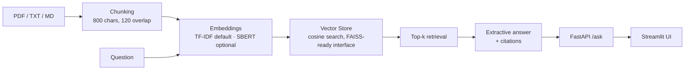

# Enterprise RAG Knowledge Assistant


> Upload enterprise documents, ask questions in plain English, and get answers **grounded in your documents — with citations**. No paid API key required to run the demo.

Built to demonstrate a production-shaped Retrieval-Augmented Generation (RAG) pipeline: ingestion → chunking → embeddings → vector retrieval → cited answering, served by FastAPI, with a Streamlit UI, Docker packaging, tests, and CI.

## Demo

```bash
pip install -r requirements.txt
uvicorn app.main:app --port 8000
```

Then open http://localhost:8000/docs and try:

```json
POST /ask
{ "question": "How many vacation days do employees get?", "top_k": 3 }
```

**Verified response** (sample handbook indexed on startup):

> Based on company_handbook.txt: *"…Full-time employees receive 20 vacation days per year…"* — with the source chunk, chunk id, and retrieval score returned as citations.

Or skip the API entirely: `python scripts/demo.py`
Or with UI: `docker compose up` → http://localhost:8501

## Architecture



## Key design decisions (and why)

| Decision | Reasoning |
|---|---|
| **Zero-key default backend** | TF-IDF retrieval is deterministic, fast, and strong on enterprise text full of exact terms/acronyms. A fresh clone runs in minutes — no model download, no API bill. |
| **Optional SBERT upgrade** | Set `USE_SBERT=1` (see `requirements-optional.txt`) and the *same interface* switches to Sentence-Transformers semantic embeddings. Retrieval layer is backend-agnostic by design. |
| **Extractive answering** | Answers are built only from retrieved chunks, so the system cannot hallucinate beyond its sources. An LLM generator can be added behind the same API without touching retrieval. |
| **Citations on every answer** | Source file, chunk id, score, and excerpt — the trust feature enterprise users actually ask for. |
| **Overlap chunking** | 800-char chunks with 120-char overlap, splitting on paragraph/sentence boundaries first, so answers split across boundaries aren't lost. |

## Evaluation

`python -m evaluation.evaluate` — labelled questions checked against their expected source document:

**Top-3 retrieval accuracy: 6/6 (100%) on the sample set** · `pytest`: **9 passed** (chunking, retrieval, API)

Honest scope: this is a small sample set for smoke-testing retrieval, not a benchmark claim. The script is included so anyone can extend it with their own labelled questions.

## API

| Endpoint | Description |
|---|---|
| `GET /health` | Status, indexed chunk count, active embedding backend |
| `GET /stats` | Sources and chunk count |
| `POST /ingest` | Upload a PDF / TXT / MD file and index it |
| `POST /ingest-text` | Index raw text with a source name |
| `POST /ask` | `{question, top_k}` → answer + citations |

## Project structure

```
app/          FastAPI service (lifespan startup indexes sample docs)
rag/          chunking.py · embeddings.py (TF-IDF / SBERT) · store.py · engine.py
ui/           Streamlit chat UI (talks to the API only)
data/sample/  Sample handbook + ML glossary — demo works out of the box
evaluation/   Top-k retrieval evaluation script
tests/        9 tests: chunking, engine/retrieval, API
```

## Roadmap

- [ ] Persistent Qdrant/FAISS index on disk
- [ ] Optional LLM answer generation (OpenAI / Llama) behind `/ask`
- [ ] Hybrid search (BM25 + semantic) and re-ranking
- [ ] Per-document access control and multi-tenant collections

## Tech stack

Python · FastAPI · Pydantic · Sentence-Transformers (optional) · FAISS-ready vector store · Streamlit · Docker · pytest · GitHub Actions

## Author

**Hema Sai Paruchuri** — Machine Learning Engineer (Python, ML/GenAI, FastAPI, Docker) · MS Computer Science, Southern Illinois University Edwardsville

